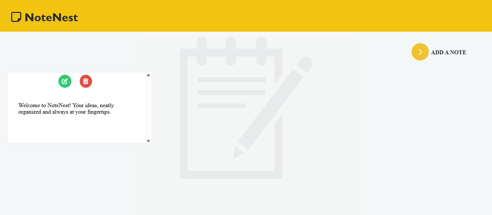

# NoteNest-web
 NoteNest-Web is a simple and efficient web-based note-taking app designed to help you organize your thoughts, ideas, and tasks seamlessly.
# 🚀 Features :

📝 Create, edit, and delete notes

💾 Stores notes in local storage (persists even after closing the browser)

🎨 Clean and responsive UI

🔍 Easy to use

# Live Demo :
Check out the live version of NoteNest here:  
👉 [https://webnotenest.netlify.app](https://webnotenest.netlify.app)

# 🛠️ Technologies Used :

HTML - Structure

CSS - Styling and responsiveness

JavaScript - Functionality

Local Storage - Saves notes without a backend

# 📸 Preview :
Here’s a glimpse of NoteNest in action:  

# 📂 Installation & Usage :

Clone the repository
git clone https://github.com/yashsri2802/NoteNest-Web.git

Navigate to the project folder
cd NoteNest-Web

Open index.html in your browser

Alternatively, use Live Server in VS Code for a better development experience.

# 📌 Future Enhancements: 

✨ Rich text formatting

☁️ Cloud storage integration

🔔 Reminders & notifications

# 💡 Contributing
Feel free to fork the repo and contribute! Open an issue if you find bugs or want to suggest improvements.

# 📜 License
This project is licensed under the MIT License.
